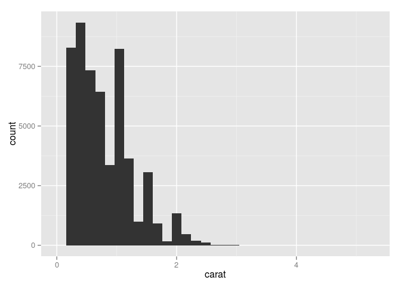
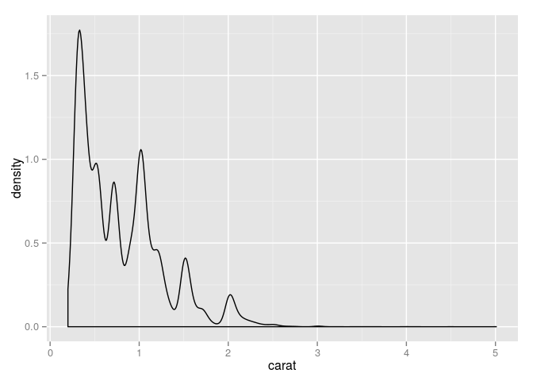
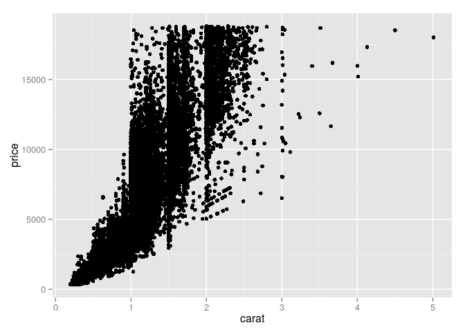
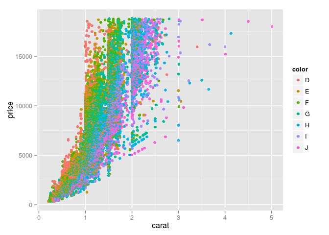
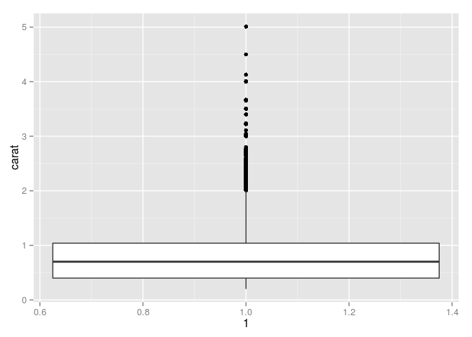
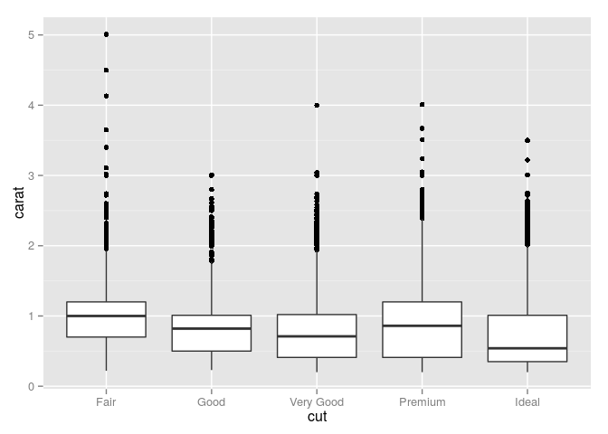
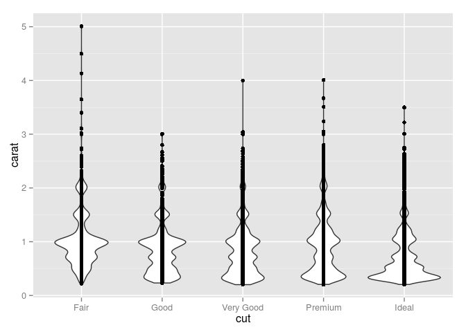
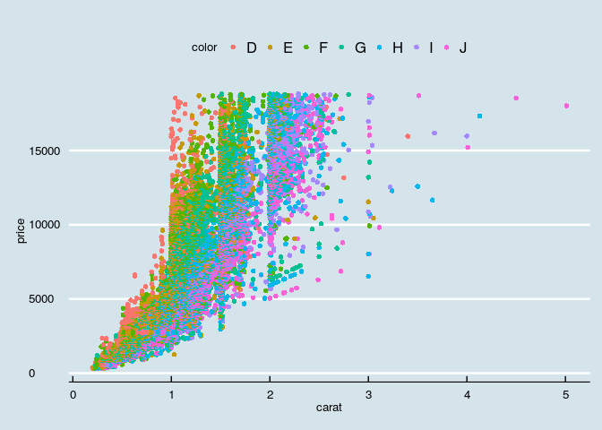

# 000-r-lesson
Daniel Chen  
11/16/2014  

# conditionals and making decisions

```r
num <- 37
if(num > 100){
  print("greater")
} else{
    print("not greater")
}
```

```
## [1] "not greater"
```

## if/else if/else

```r
num <- 37
if(num > 40){
  print("greater")
} else if (num < 40){
  print("less than")
} else{
    print("not greater")
}
```

```
## [1] "less than"
```

## Problem 1

### 50

```r
# write a function, that takes in a number, and returns TRUE
# if it is less than 50
# returns FALSE if >= 50
cut_50 <- function(number){
  if(number < 50){
    print(TRUE)
  } else{
    print(FALSE)
  }
}
cut_50(0)
```

```
## [1] TRUE
```

```r
cut_50(50)
```

```
## [1] FALSE
```

```r
cut_50(100)
```

```
## [1] FALSE
```

### 50 with neg

```r
# write a function that takes in a number, returns "neg"
# if < 0
# returns "SMALL" if >= 0 and < 50
# returns "big" if >= 50
cut_50_neg <- function(number){
  if(number < 0){
    print("neg")
  } else if (number < 50){
    print("SMALL")
  } else {
    print("big")
  }
}

cut_50_neg(-1)
```

```
## [1] "neg"
```

```r
cut_50_neg(0)
```

```
## [1] "SMALL"
```

```r
cut_50_neg(50)
```

```
## [1] "big"
```

# Plot
## ggplot2

```r
library(ggplot2)
View(diamonds)
head(diamonds)
```

```
##   carat       cut color clarity depth table price    x    y    z
## 1  0.23     Ideal     E     SI2  61.5    55   326 3.95 3.98 2.43
## 2  0.21   Premium     E     SI1  59.8    61   326 3.89 3.84 2.31
## 3  0.23      Good     E     VS1  56.9    65   327 4.05 4.07 2.31
## 4  0.29   Premium     I     VS2  62.4    58   334 4.20 4.23 2.63
## 5  0.31      Good     J     SI2  63.3    58   335 4.34 4.35 2.75
## 6  0.24 Very Good     J    VVS2  62.8    57   336 3.94 3.96 2.48
```

### base histogram

```r
hist(diamonds$carat, main = "Carat Histogram",
      xlab = "Carat")
```

 


```r
plot(price ~ carat, data = diamonds)
```

 


```r
boxplot(diamonds$carat)
```

 

## ggplot

```r
ggplot(data = diamonds) + geom_histogram(aes(x = carat))
```

```
## stat_bin: binwidth defaulted to range/30. Use 'binwidth = x' to adjust this.
```

 


```r
ggplot(data = diamonds) + geom_density(aes(x = carat))
```

 


```r
ggplot(data = diamonds, aes(x = carat, y = price)) + geom_point()
```

 


```r
# saving plots to varibles
g <- ggplot(data = diamonds, aes(x = carat, y = price)) + geom_point(aes(color = color))
g
```

 


```r
ggplot(diamonds, aes(y = carat, x = 1)) + geom_boxplot()
```

 


```r
ggplot(diamonds, aes(y = carat, x = cut)) + geom_boxplot()
```

 


```r
ggplot(diamonds, aes(y = carat, x = cut)) + geom_violin() + geom_point()
```

 


```r
library(ggthemes)
g <- ggplot(diamonds, aes(x = carat, y = price)) + geom_point(aes(color = color))
g + theme_economist()
```

 

```r
g
```

 

